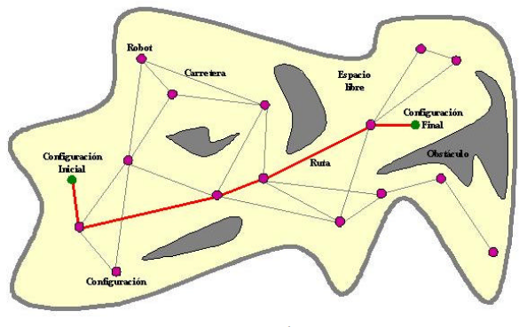
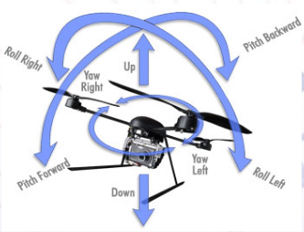
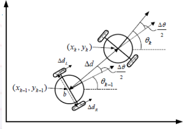
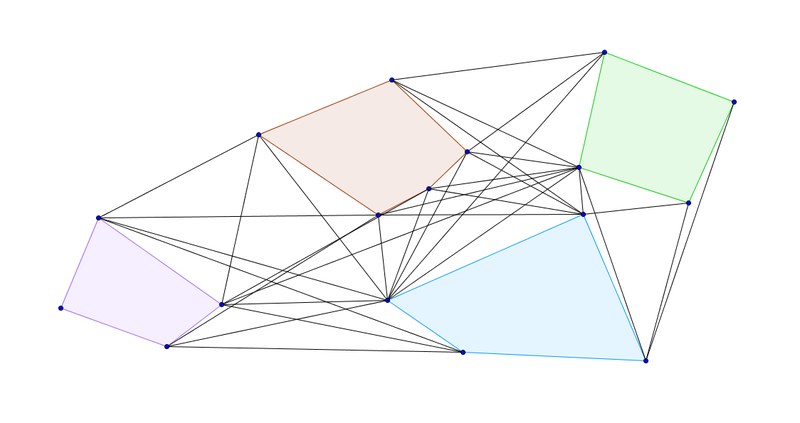
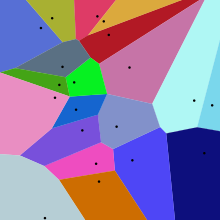
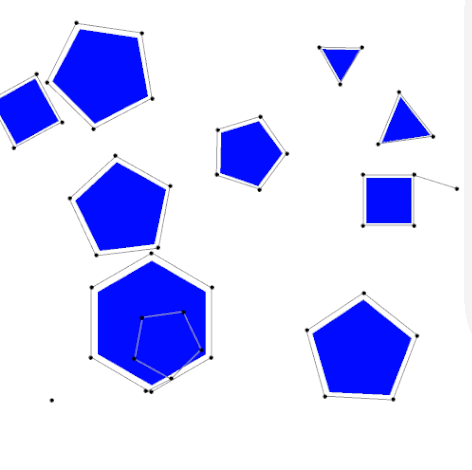

# Examen Parcial

**Alumno:** Paul Sebastian Aguilar Enriquez  
**Número de cuenta:** 415028130

## Nota al lector

Este documento fue escrito originalmente en `Markdown` y posteriormente exportado a un PDF, por lo cual, para una mejor lectura, revisar el documento original en [https://github.com/mnegretev/MobileRobots-2020-2-for-Covid19/blob/aguilar_enriquez/Entregables/examen/README.md](https://github.com/mnegretev/MobileRobots-2020-2-for-Covid19/blob/aguilar_enriquez/Entregables/examen/README.md).

## Nota 2 al lector

Por cierto, este texto contiene GIFs, ¿no quieres verlos todos feos en un PDF
verdad?, para una mejor lectura, revisar el documento original en [https://github.com/mnegretev/MobileRobots-2020-2-for-Covid19/blob/aguilar_enriquez/Entregables/examen/README.md](https://github.com/mnegretev/MobileRobots-2020-2-for-Covid19/blob/aguilar_enriquez/Entregables/examen/README.md).

## Preguntas
### 1. Explique qué es la configuración, espacio de configuraciones y grados de libertad de un robot móvil.

#### Configuración

Una configuración de un robot define un estado específico del robot. De manera
simple define la posición y orientación del robot y depende directamente de su construcción física y las limitaciones que esta implica.

En el caso de robots móviles es el cómo  estarán  distribuidos  los principales  
elementos  que  lo  componen:  ruedas, motores,  encoders, etc.

En  relación  a  las  ruedas,  existen  distintas configuraciones,las más
comunes son: diferencial, triciclo, Ackerman, sincronizada,  omnidireccional,  con  múltiples  grados de libertad y movimiento mediante orugas

#### Espacio de configuraciones

Cuando el robot no colisiona con ninguno  de  los  obstáculos  se  dice  que  se
encuentra  en  el  espacio  libre  y  la  configuración es libre; en caso
contrario la configuración está en colisión.

El espacio de trabajo del robot es un espacio de  configuraciones  y  consiste  
en  el  conjunto  de  todas  las  posiciones  y  orientaciones  que el  robot  puede  tomar.

Obtener  el  espacio de  configuraciones  es  equivalente  a  que  el  robot  
recorra y se posicione en todos los puntos posibles del espacio de trabajo. El
robot se  representa  como  un  punto y los obstáculos son construidos dentro
del espacio de trabajo.

Ejemplo de un espacio de configuraciones

#### Grados de libertad

Los grados de libertad (DOF)se refieren a la mínima cantidad de variables
necesarias para especificar la configuración de un objeto.

El número de grados de libertad es igual a la dimensión del espacio de
configuración.

Para un robot móvil que se desplaza en el espacio tridimensional el número de
grados de libertad es 6.

Para un robot móvil que se desplaza en sobre un plano el número de grados de
libertad es 3.

### 2. Investigue dos métodos basados en grafos para planeación de rutas.

Los **_métodos geométricos_** o también llamados **_métodos roadmap (RM)_** se
caracterizan  por  construir primero una descripción del espacio libre con la
forma de una red o grafo para posteriormente unir los puntos inicial y final del
robot al grafo, para por último escoger aquél camino dentro del _roadmap_
(grafo) que minimice el coste (distancia o tiempo). Estos métodos son válidos
para problemas de planificación sencillos.

#### Grafos de visibilidad

Dado un conjunto de obstáculos con forma poligonal en el plano euclidiano se
dice que el grafo de visibilidad es aquel grafo en el cual cada nodo representa
un vértice de los polígonos y las aristas son las conexiones visibles entre
tales vértices. Esto quiere decir que para cada arista en el grafo de
visibilidad definida por

y
,
el segmento de recta que conecta los vértices correspondientes en el plano no se
interseca con ningún polígono (obstáculo).

Grafo de visibilidad, los nodos representan los vértices y las aristas unen
vértices visibles entre sí

#### Diagramas de Voronoi o Polígonos de Thiessen

Consiste en la descomposición de un espacio métrico en regiones asociadas a la
presencia de obstáculos, asignándole en dicha descomposición a cada uno de los
obstáculos una región en el espacio métrico la cual es formada por los puntos más
cercanos a él y a los demás obstáculo.

De esta forma se puede construir una configuración de aristas y vértices, para
la cual se pueden generar dos tipos de trayectorias, lineas rectas y parábolas.

Las lineas rectas surgen cuando se hayan a igual distancia dos aristas de dos
obstáculos diferentes, mientras que en el caso de tratarse de un vértice y una
arista resulta la parábola.

20 puntos en el plano y su partición del plano en regiones de Voronoi.

### 3. Investigue dos métodos basados en muestreo para planeación de rutas.

Los métodos basados en muestreo son los llamados **_métodos probabilísticos_**
que a diferencia de los clásicos por geometría, se basan en  la construcción de
un grafo mediante la creación de puntos aleatorios en el espacio de trabajo
(fase de muestreo o aprendizaje), intentando la unión con el grafo de los puntos
iniciales y finales y su posterior conexión dentro del mismo minimizando el
coste (fase de búsqueda).

El nombre de método probabilístico se debe a que se muestrea a ciegas el espacio
de trabajo, confiando en que cuantos más puntos se muestreen más probable será
encontrar un camino que una el punto inicial con el final.

En la fase de muestreo cada punto que se selecciona, aleatoriamente, debe
cumplir ser libre de obstáculos y poderse unir con el grafo mediante un camino
sin colisiones.

En la fase de búsqueda se busca dentro del grafo obtenido en la fase de muestreo
aquel que minimice el coste, definiendo como coste la distancia o el tiempo que
tarda en alcanzar el punto final desde el punto de inicio.

#### Mapas probabilísticos o PRM (Probabilistic Roadmap Method).

La idea básica del PRM es tomar muestras aleatorias del espacio de la
configuración del robot, probándolas para ver si están en el espacio libre, y
utilizar un planificador local para intentar conectar estas configuraciones con
otras configuraciones cercanas. Se añaden las configuraciones de inicio y de
fin, y se aplica un algoritmo de búsqueda al grafo resultante para determinar
una trayectoria entre las configuraciones de inicio y de fin.

El planificador probabilístico de la ruta consta de dos fases: una de
construcción y otra de consulta.

En la fase de construcción, se construye una hoja de ruta (grafo), que aproxima
los movimientos que se pueden realizar en el entorno. Primero, se crea una
configuración aleatoria. Luego, se conecta con los k vecinos más cercanos.
Las configuraciones y conexiones se añaden al grafo hasta que el mapa de ruta es
lo suficientemente denso.

En la fase de consulta, las configuraciones de inicio y fin se conectan al
grafo, y el camino se obtiene mediante un algoritmo de búsqueda de caminos como
Dijkstra.

Ejemplo de PRM que explora caminos factibles alrededor de una serie de
obstáculos poligonales.

Este es un GIF, te recomendamos revisar [el documento original dando clic aquí](https://github.com/mnegretev/MobileRobots-2020-2-for-Covid19/blob/aguilar_enriquez/Entregables/examen/README.md).

#### Exploración  rápida  de  árboles  aleatorios  o  RRT  (Rapidly  Exploring  Random Tree).

Rapidly-exploring Random Tree (RTT) es un algoritmo diseñado para buscar
eficientemente espacios no convexos de alta dimensión mediante la construcción
aleatoria de un árbol de relleno de espacio. El árbol se construye  de  forma  
incremental  a  partir  de  muestras  extraídas  al  azar  del  espacio  de
búsqueda  y  está intrínsecamente sesgada para crecer hacia grandes áreas no
buscadas del problema

A medida que se dibuja cada muestra, se intenta una conexión entre
ella y el estado (desplazamiento) más cercano en el árbol. Si la conexión es
factible esto resulta en la adición del nuevo estado al árbol. Con un muestreo
uniforme del espacio de búsqueda, la probabilidad de expandir un estado
existente es proporcional al tamaño de su polígono de Voronoi, estos polígonos se
van generando conforme se construye el árbol y se mapean obstáculos.

Animación de un RTT de 1000 iteraciones.

Este es un GIF, te recomendamos revisar [el documento original dando clic aquí](https://github.com/mnegretev/MobileRobots-2020-2-for-Covid19/blob/aguilar_enriquez/Entregables/examen/README.md).

### 4. Explique en qué consiste el proceso de SLAM (Simultaneous Localization and Mapping).

La localización y modelado simultáneos, mapeo y localización simultáneos​ o SLAM,
es una técnica usada por robots y vehículos autónomos para construir un mapa de
un entorno desconocido en el que se encuentra, a la vez que estima su
trayectoria al desplazarse dentro de este entorno.

Dada una serie de controladores

y sensores de observacion

sobre una serie de pasos en tiempo discreto
,
SLAM calcula una estimación del estado del agente

(en este caso el robot) y un mapa del medio ambiente
.

Las mediciones son probabilísticas, así que el objetivo es calcular 

Con lo anterior se busca calcular la trayectoria y el mapa.

Aplicando la regla de Bayes se genera una referencia para actualizar
secuencialmente la siguiente posición del agente, dado un mapa y una función de
transición 

.

Como se dijo, con lo anterior podemos estimar la siguiente posición del agente.

Se manera similar a lo anterior podemos calcular la siguiente iteración del
mapa.

Como muchos problemas de inferencia, las soluciones para inferir las dos
variables juntas pueden ser encontradas en una solución óptima local, alternando
las actualizaciones de las dos variables en una forma de algoritmo EM (algoritmo
  esperanza-maximización).

Animación de un agente aplicando SLAM a un entorno desconocido.

Este es un GIF, te recomendamos revisar [el documento original dando clic aquí](https://github.com/mnegretev/MobileRobots-2020-2-for-Covid19/blob/aguilar_enriquez/Entregables/examen/README.md).

### 5. Explique en qué consiste la localización mediante filtros de partículas, sus ventajas sobre el Filtro de Kalman y los paquetes de ROS que lo implementan.

#### Localización mediante filtros de partículas

El filtro de partículas es un método empleado para estimar el estado de un
sistema que cambia a lo largo del tiempo.

Básicamente, se compone de un conjunto de muestras (las partículas) y unos
valores, o pesos, asociados a cada una de esas muestras, los cuales se
encuentran en valores normalizados [0,1]. Los pesos definen la importancia
de la muestra.

Las partículas son estados posibles del proceso, que se pueden representar como
puntos en el espacio de estados de dicho proceso.

El problema de estimación de la localización se restringe a un filtro Bayesiano
cuyo  objetivo  es  encontrar  la  probabilidad  de  posición  del  robot.  

La  función  de densidad de probabilidad es una aproximación bayesiana que
engloba toda la información que tenemos sobre un estado
, y de ella se estima
la posición real .

El algoritmo se centra en calcular:

Donde  es la información
que obtenemos de los sensores.

El algoritmo consta de cuatro etapas:

- Inicialización
- Actualización
- Estimación
- Predicción

#### Filtro de partículas vs Filtro Kalman

Una limitación del filtro de Kalman es asumir que las variables de estado se
distribuyen como una Gaussiana. Por ello, el filtro de Kalman proporciona pobres  
estimaciones  para  variables  de  estado  que  no  sigan  esta  distribución.

Lo anterior se resumen en que el filtro de partículas que no pide restricciones
en las funciones deterministas y tampoco pide una distribución en concreto para
la distribución del ruido.

#### Paquetes de ROS

Los paquetes que implementan filtros de partículas en ROS son:

- CoreSLAM
- SLAM_gmapping
- Stageros

### 6. Investigue qué son los campos potenciales y explique los pasos generales para implementarlos.

Los campos potenciales se basan en la analogía de los campos potenciales
eléctricos en la cual al robot se le ve como una partícula de carga eléctrica,
al espacio libre se le considera como un campo potencial, los obstáculos tienen
una carga eléctrica del mismo signo del robot (se repelen) y la meta tiene una
carga eléctrica de signo opuesto al robot (se atraen).

El campo de potencial diferencial se construye  sumando el campo de la meta

y el campo de los obstáculos

:

A partir e este campo se construye un campo de fuerzas artificial:

Una vez construido el campo de fuerzas, el robot se mueve en función de la
fuerza local.

Para obtener las fuerzas hay que modelar las funciones de potencial de la
meta y obstáculos (calculando el potencial para cada punto del espacio) libre:

Meta (atractor parabólico):

Obstáculo (barrera potencial exponencial) :

Algunas ventajas de trabajar con campos potenciales es que las trayectorias que
se general son suaves y se facilita el acoplar la parte de planeación con la de
control.

Un gran problema es el trabajar con mínimos locales.

### 7. Explique qué es una transformación homogénea y para qué se utiliza en robots móviles.

Para hablar de la matriz homogénea es necesario hablar de las coordenadas
homogéneas, las cuales permiten la representación conjunta de traslación y
rotación.

Así la matriz de transformación homogénea es una matriz de dimensión 4x4 que
representa la transformación de un vector de coordenadas homogéneas de un
sistema de coordenadas a otro.

Se puede considerar una matriz homogénea aquella que se haya compuesto por 4
sub matrices:

- Matriz de rotación
- Vector de traslación
- Transformación de perspectiva
- Escalado global

Así, las matrices de transformación homogénea se utilizan para:

- Representar la posición y orientación de un sistema girado y trasladado con
respecto a un sistema fijo.
- Transformar un vector expresado en coordenadas movibles y su representación en
un sistema fijo.

Generalmente el sistema es el robot y el sistema fijo es el espacio o entorno en
donde se mueve.

### 8. Investigue qué es un robot con restricciones no holonómicas de movimiento.

El área de la robótica tiene dos grandes brazos

- Robot holonómicos
- Robot no-holonómicos

La holonomicidad es una característica que depende de la movilidad del robot
(características cinemáticas). El primer grupo corresponde a robots formados
por ligaduras, como los son los brazos y manipuladores. El segundo corresponde
a los robot móviles en general.

Si el número de grados de libertad controlables:

- Son todos los del robot, se dice que el robot es holonómico
- No son todos los del robot, se dice que es un robot no-holonómico
- Es mayor que los del robot, se dice que es un sistema redundante

En resumen, un robot con restricciones no holonómicas es un robot móvil en el
cual sus grados de libertad controlables son menores al numero total de sus
grados de libertad.

### Referencias

- [Diseño Mecatrónico de un Robot Móvil  (Configuración Diferencial)](http://www.mecamex.net/anterior/cong08/articulos/32.pdf)
- [Heurística para la generación de configuraciones en pasajes estrechos aplicada al problema de los clavos - Capitulo 1](http://catarina.udlap.mx/u_dl_a/tales/documentos/msp/de_l_ea/capitulo1.pdf)
- [Control cinemático y dinámico de robots omnidireccionales](https://www.femexrobotica.org/eir2016-2017/wp-content/uploads/robots_omnidireccionales.pdf)
- [Planificación de caminos basada en modelo combinando algoritmos de búsqueda en grafo, derivados de RRT y RRT*.](https://bibing.us.es/proyectos/abreproy/71064/fichero/1064-MONTES.pdf)
- [Navegación y Planificación de Rutas](https://porprofesionalmic.files.wordpress.com/2015/09/investigacion-documental-navegacion-planificacion-rutas.pdf)
- [Grafo de visibilidad](https://es.wikipedia.org/wiki/Grafo_de_visibilidad)
- [Polígonos de Thiessen](https://es.wikipedia.org/wiki/Pol%C3%ADgonos_de_Thiessen)
- [Probabilistic roadmap](https://en.wikipedia.org/wiki/Probabilistic_roadmap)
- [Rapidly exploring random tree](https://en.wikipedia.org/wiki/Rapidly-exploring_random_tree)
- [Localización y modelado simultáneos](https://es.wikipedia.org/wiki/Localizaci%C3%B3n_y_modelado_simult%C3%A1neos)
- [Introduction to Mobile Robotics; SLAM: Simultaneous Localization and Mapping](http://ais.informatik.uni-freiburg.de/teaching/ss12/robotics/slides/12-slam.pdf)
- [Simultaneous localization and mapping; Mathematical description of the problem](https://en.wikipedia.org/wiki/Simultaneous_localization_and_mapping#Mathematical_description_of_the_problem)
- [Filtro de partículas](https://es.wikipedia.org/wiki/Filtro_de_part%C3%ADculas)
- [Implementación de localización geométrica pararobots móviles bajo ROS](https://e-archivo.uc3m.es/bitstream/handle/10016/27198/TFG_Marina_Galli.pdf)
- [ESTUDIO DEL FILTRO DE PARTÍCULAS APLICADO AL SEGUIMIENTO DE OBJETOS EN SECUENCIAS DE IMÁGENES](https://e-archivo.uc3m.es/bitstream/handle/10016/11173/PFC%20Alvaro%20Rodriguez.pdf)
- [Introduccióna la Robótica](https://ccc.inaoep.mx/~esucar/Clases-irob/ir8-plan.pdf)
- [Fundamentos de Robótica; Herramientas Matemáticas para la Localización Espacial; Matrices de Transformación Homogéneas](http://www.eudim.uta.cl/rmendozag/courses/fundamentos_robotica/lectures/matrices_homogeneas.pdf)
- [Robótica2. Modelado Cinemática de Robots](https://www.utm.mx/~hugo/robot/Robot2.pdf)
- [Conceptos de Robótica; Seminario de Modelo y Métodos Cuantitativos](https://www.inf.utfsm.cl/~noell/SMMC/mat2006/Cap2.pdf)
