# Práctica 02

**Alumno:** Paul Sebastian Aguilar Enriquez  
**Número de cuenta:** 415028130

## Nota al lector

Este documento fue escrito originalmente en `Markdown` y posteriormente exportado a un PDF, por lo cual, para una mejor lectura, revisar el documento original en [https://github.com/mnegretev/MobileRobots-2020-2-for-Covid19/blob/aguilar_enriquez/Entregables/practica_02/README.md](https://github.com/mnegretev/MobileRobots-2020-2-for-Covid19/blob/aguilar_enriquez/Entregables/practica_02/README.md).

## Objetivo

- Uso de archivos urdf y árbol de transformaciones con el paquete tf.
- Realizar los ejercicios de las diapositivas 10 y 11.

## Entregables

- Capturas de pantalla donde se observe que se cambió el urdf
- Capturas de pantalla donde se observe que se cambió el mapa
- Capturas de pantalla con la etiqueta ‘origin’ cambiada
- Capturas de pantalla con alguna de las etiquetas ‘joint’ eliminada
- Comentarios sobre lo que sucedió en cada uno de los casos anteriores
- Copia de los archivos urdf y launch con las modificaciones hechas

### Capturas de pantalla donde se observe que se cambió el urdf

El archivo venia configurado originalmente con `robotino.urdf` y se modifico por
`justina_simple.urdf`.

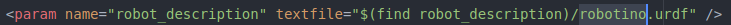

Original

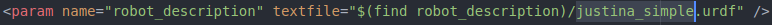

Modificado

Lo anterior modifico el robot cargado en escena.

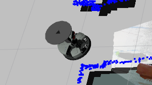

Original, Robotino.

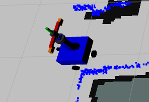

Modificado, Justina.

### Capturas de pantalla donde se observe que se cambió el mapa

El archivo venia configurado originalmente con `Universum.yaml` y se modifico por
`Biorobotica.yaml`.

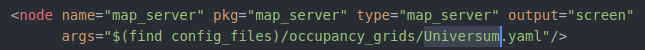

Original

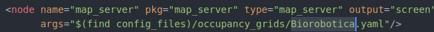

Modificado

Lo anterior modifico el mapa cargado en escena.

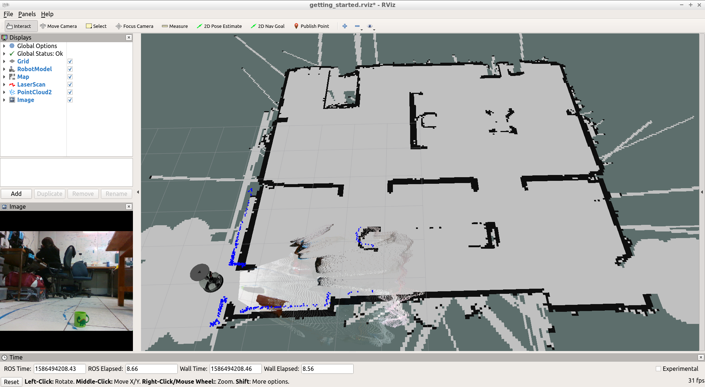

Original, mapa de Universum.

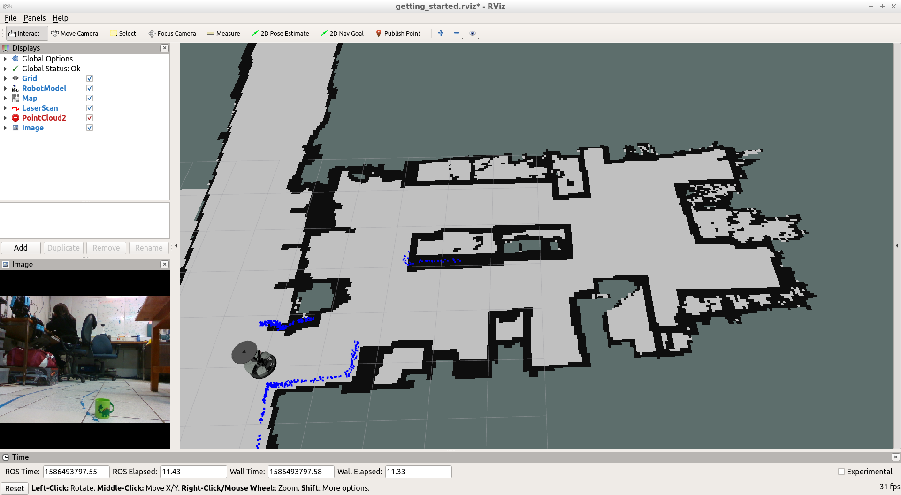

Modificado, mapa de Biorobotica.

### Capturas de pantalla con la etiqueta ‘origin’ cambiada

El archivo venia configurado originalmente con `0 0 0.25` y se modifico por
`0 0 0`.

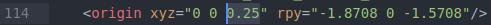

Original

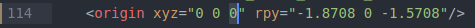

Modificado

Lo anterior modifico el alcance del angulo de visión en Z, esto debido a que
ese es el componente al que se le modifico la coordenada de origen con respecto
a su padre.

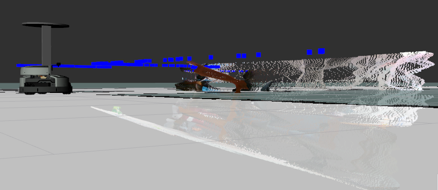

Original, con 0.25 en Z

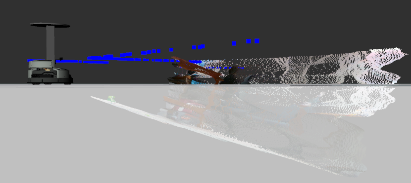

Modificado, con 0 en Z.

### Capturas de pantalla con alguna de las etiquetas ‘joint’ eliminada

Se procedio a eliminar el joint de `camera_depth_optical_frame`.

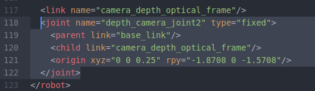

Original

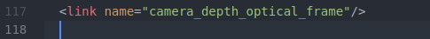

Eliminado

Al eliminar ese joint la definición del robot era incorrecta por lo cual se marco un error y este no se cargo en escena.

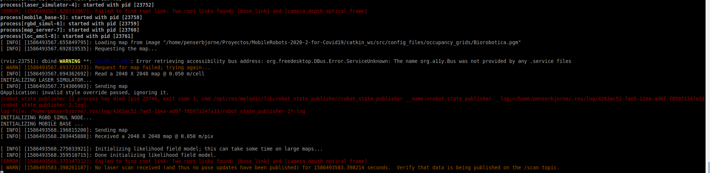

Error

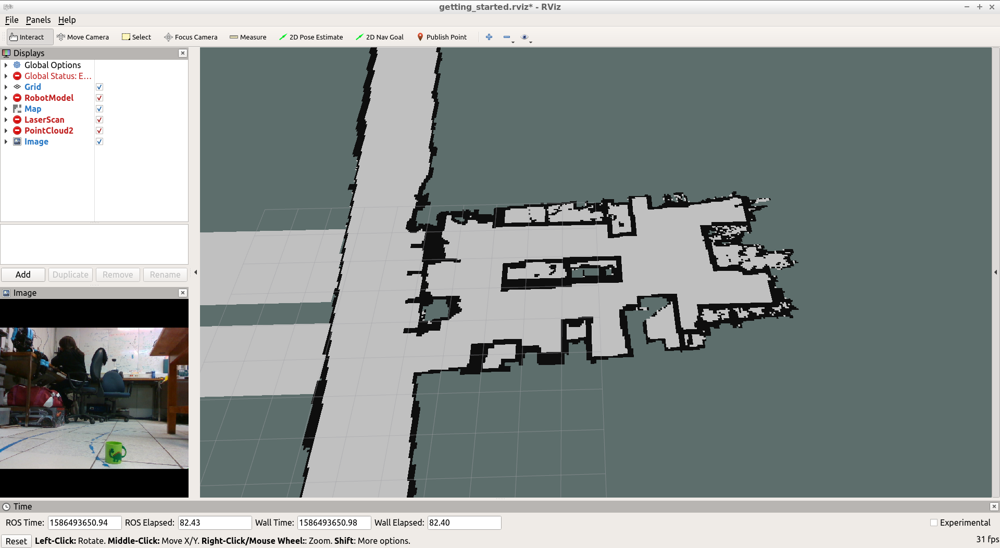

Robot sin cargar en escena

Lo que se hizo para corregir este error fue borrar el joint con su elemento padre. Esto permitio cargar el robot ya que su definición era correcta, pero con la ausencia de ese elemento se alteraron sus componentes y funcionamiento como podemos ver.

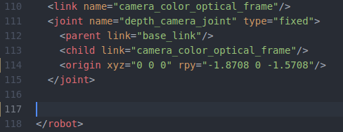

Aqui se elimino completamente el `link` y su `joint`, solamente se pone la imagen para que se vean los numeros de linea correspondientes y confirmar la eliminación de esas lineas.

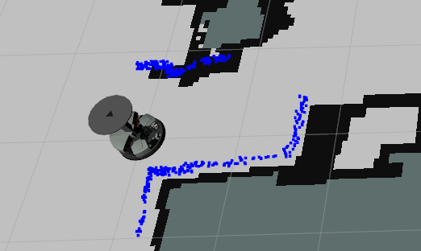

Robot en escena pero sin el deep_view de la camara RGB.

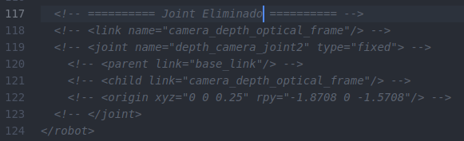

`link` y `joint` comentados en el archivo

### Comentarios sobre lo que sucedió en cada uno de los casos anteriores

Los comentarios se incluyeron en cada sección anterior.

### Copia de los archivos urdf y launch con las modificaciones hechas

- [Salida del comando tf info](./info.txt)
- [Copia de robotino_simul.launch](./robotino_simul.launch)
- [Copia de robotino.urdf](./robotino.urdf)
