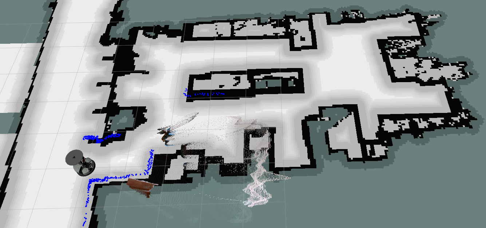
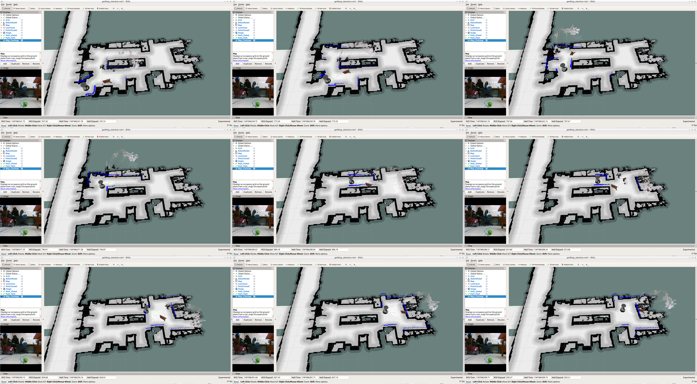
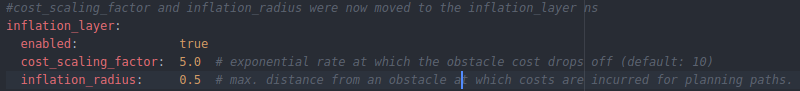
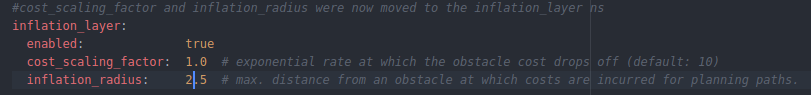
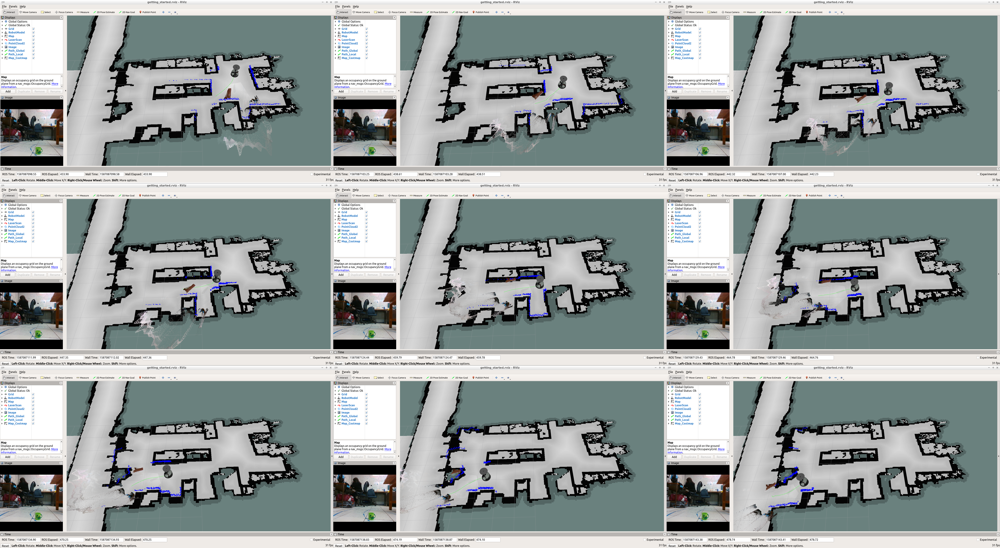
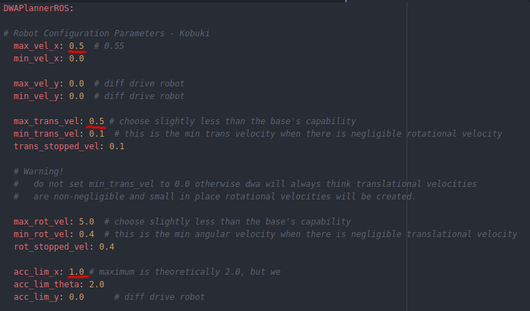
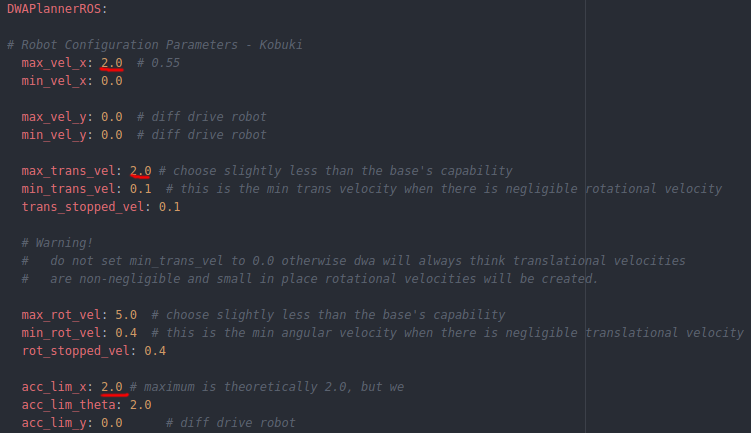
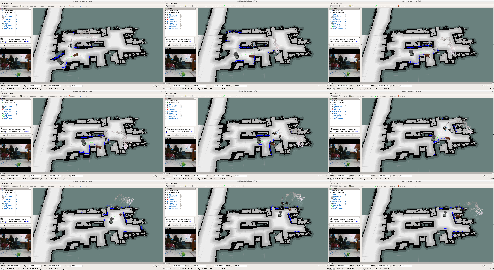

# Práctica 03

**Alumno:** Paul Sebastian Aguilar Enriquez  
**Número de cuenta:** 415028130

## Nota al lector

Este documento fue escrito originalmente en `Markdown` y posteriormente exportado a un PDF, por lo cual, para una mejor lectura, revisar el documento original en [https://github.com/mnegretev/MobileRobots-2020-2-for-Covid19/blob/aguilar_enriquez/Entregables/practica_03/README.md](https://github.com/mnegretev/MobileRobots-2020-2-for-Covid19/blob/aguilar_enriquez/Entregables/practica_03/README.md).

## Objetivo

- Uso del *navigation stack* para navegación en 2D.
- Realizar los ejercicios de las diapositivas 16 y 17

## Entregables

- Capturas de pantalla (varias) donde se observe la ruta planeada y el movimiento del robot.
- Comentarios sobre lo sucedido al cambiar los parámetros indicados en el ejercicio.
- Copia de los archivos `yaml` con los parámetros modificados.

### Desarrollo

Se cargaron los tópicos indicados:

- `/move base/DWAPlannerROS/global_plan`
- `/move base/DWAPlannerROS/local_plan`
- `/move base/global_costmap/costmap`

Tópicos cargados.

Mapa modificado por el tópico de `costmap`.

Fijar una meta con el botón `2D Nav Goal` y observar el comportamiento.

Ruta recorrida por el robot.

Del archivo `catkin ws/src/config_files/move_base_params/costmap_common_params.yaml` se modificaron los siguientes parámetros:

- `cost_scaling_factor` a 1.0
- `inflation_radius` a 2.5

Estos parámetros corresponden a la tasa exponencial en la cual el costo de un obstáculo se deja fuera de los cálculos, y a la distancia máxima en la que el costo de un obstáculo se toma en cuenta por el planeador de rutas.

Parámetros originales

Parámetros modificados.

Al haber modificado los parámetros anteriores, los cálculos del planeador se modificaron, lo cual dio la sensación de que el robot comenzó a hacer movimientos mas rápidos y fluidos.

Ruta recorrida por el robot.

Del archivo `catkin_ws/src/config_files/move_base_params/dwa_local_planner params.yaml` se modificaron los siguientes parámetros:

- `max_vel_x` a 2.0
- `max_trans_vel` a 2.0
- `acc_lim_x` a 2.0

Estos parámetros deben estar acotados a las capacidades de la base del robot. Estas sirven para indicar la velocidad y aceleración en los ejes y de manera transversal.

Parámetros originales

Parámetros modificados.

En esta ocasión, al haber modificado la velocidad y la aceleración (para el eje X y para movimientos transversales) el robot tuvo un desplazamiento más rápido.

Ruta recorrida por el robot.

### Copia de los archivos urdf y launch con las modificaciones hechas

- [Copia de costmap_common_params.yaml](./costmap_common_params.yaml)
- [Copia de dwa_local_planner_params.yaml](./dwa_local_planner_params.yaml)
