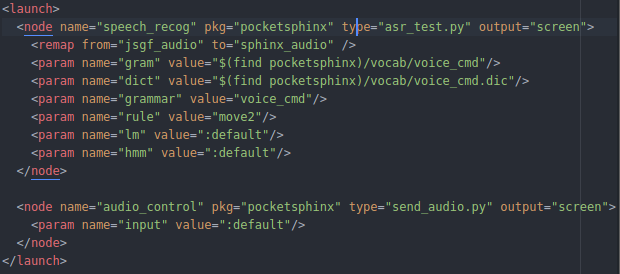
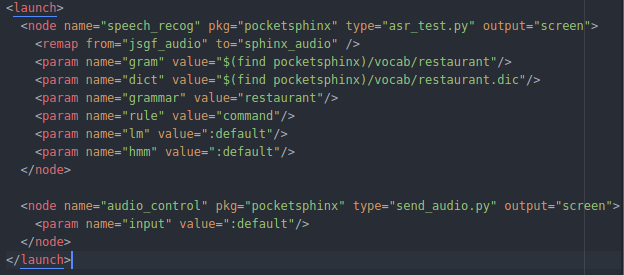
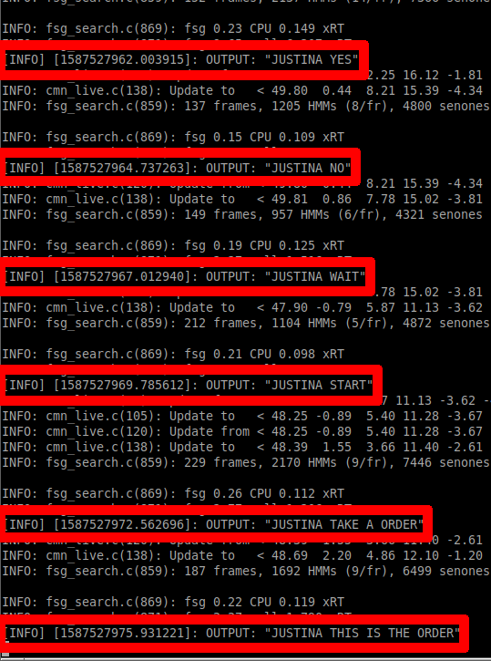
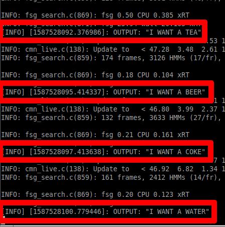

# Práctica 04

**Alumno:** Paul Sebastian Aguilar Enriquez  
**Número de cuenta:** 415028130

## Nota al lector

Este documento fue escrito originalmente en `Markdown` y posteriormente exportado a un PDF, por lo cual, para una mejor lectura, revisar el documento original en [https://github.com/mnegretev/MobileRobots-2020-2-for-Covid19/blob/aguilar_enriquez/Entregables/practica_04/README.md](https://github.com/mnegretev/MobileRobots-2020-2-for-Covid19/blob/aguilar_enriquez/Entregables/practica_04/README.md).

## Objetivo

- Reconocimiento de voz usando *pocketsphinx*.
- Realizar los ejercicios de la diapositiva 19.

## Entregables

- Ejemplos de frases que se pueden reconocer de acuerdo con la gramática `restaurant.gram`.
- Explicación breve de lo que significan los cuatro parámetros mencionados en el punto 5 de la diapositiva 19.
- Capturas de pantalla donde se observen las frases reconocidas.
- Copia del archivo launch con los parámetros modificados.

### Desarrollo

#### Frases que se pueden reconocer de acuerdo con la gramática

Las siguientes frases se generan por la gramática y fueron reconocidas por `pocketsphinx`:

- JUSTINA YES
- JUSTINA NO
- JUSTINA WAIT
- JUSTINA START
- JUSTINA TAKE A ORDER
- JUSTINA THIS IS THE ORDER
- I WANT A TEA
- I WANT A BEER
- I WANT A COKE
- I WANT A WATER

Las siguientes frases se generan por la gramática y pero no fueron reconocidas por `pocketsphinx`:

- I WANT [A] PRINGLES
- I WANT [A] CHIPS
- I WANT [A] PASTA
- I WANT [A] COOKIES
- I WANT [A] NOODLES
- I WANT [A] TUNA FISH
- I WANT [A] PICKLES
- I WANT [A] CHOCO FLAKES
- I WANT [A] ROBO O'S
- I WANT [A] MUESLI
- I WANT [A] M AND M

#### Parámetros modificados en el archivo `launch`

Del aarchivo `catkin_ws/src/bring_up/launch/pocketsphinx_text.launch` se modificaron los siguientes parámetros:

- `gram`: Indica la ruta del archivo con la gramática a utilizar por pocketsphinx.
- `dict`: Indica la ruta del archivo con el diccionario a utilizar por pocketsphinx.
- `grammar`: Indica el nombre de la gramática a utilizar para el reconocimiento de voz.
- `rule`: Indica la regla inicial con la cual se haran las derivaciones de gramatica para el reconocimiento de voz.

Parámetros originales.

Parámetros modificados.

#### Frases reconocidas

Frases reconocidas (01)

Frases reconocidas (02)

### Copia del archivo `launch` con las modificaciones hechas

- [Copia de pocketsphinx_text.launch](./pocketsphinx_text.launch)
