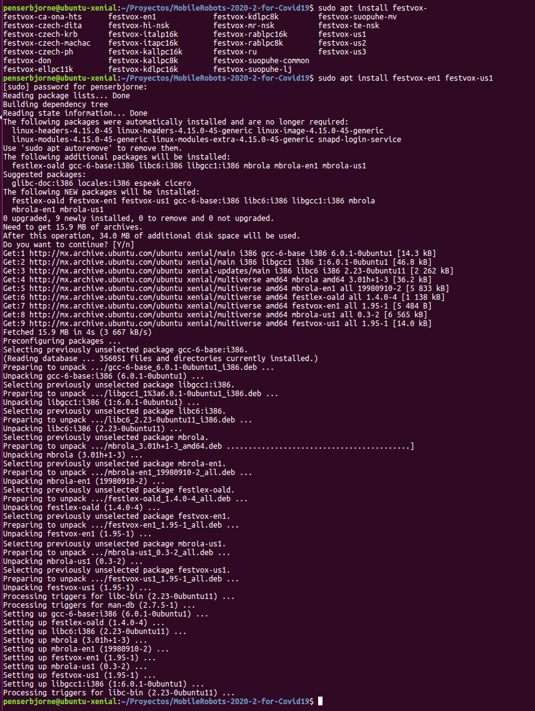
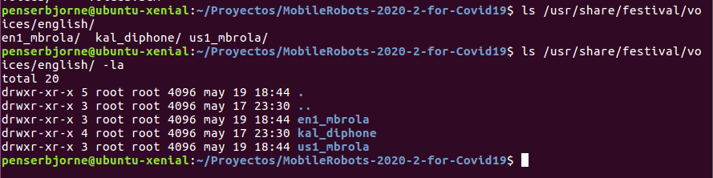
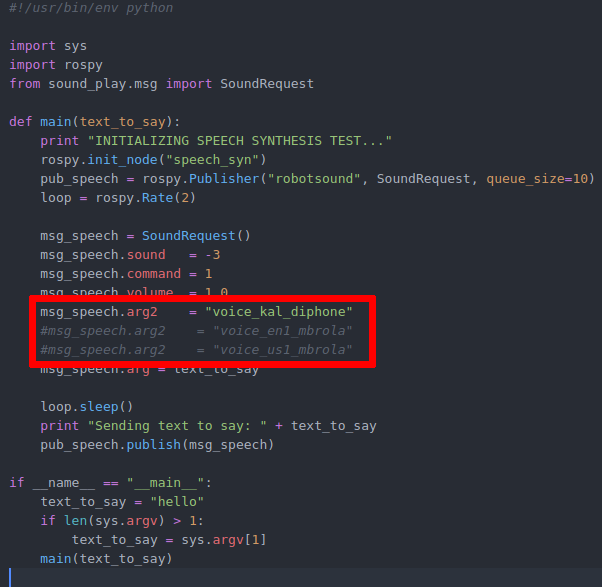
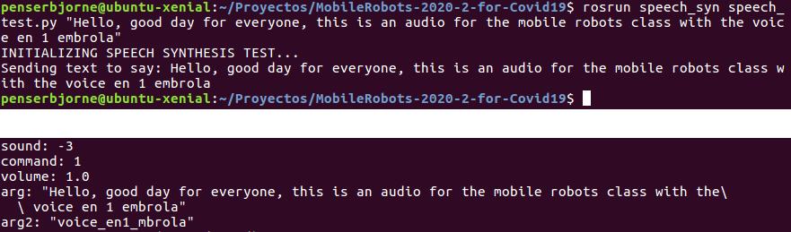
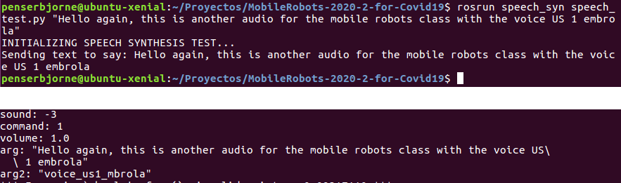
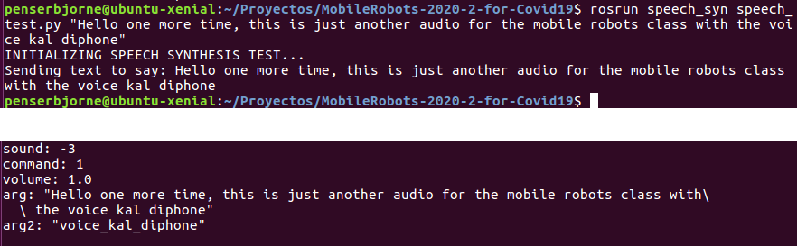

# Práctica 05

**Alumno:** Paul Sebastian Aguilar Enriquez  
**Número de cuenta:** 415028130

## Nota al lector

Este documento fue escrito originalmente en `Markdown` y posteriormente exportado a un PDF, por lo cual, para una mejor lectura, revisar el documento original en [https://github.com/mnegretev/MobileRobots-2020-2-for-Covid19/blob/aguilar_enriquez/Entregables/practica_05/README.md](https://github.com/mnegretev/MobileRobots-2020-2-for-Covid19/blob/aguilar_enriquez/Entregables/practica_05/README.md).

## Objetivo

- Síntesis de voz con *festival*.
- Realizar los ejercicios de las diapositivas 21, 22 y 23

## Entregables

- Archivos de audio donde se escuchen frase sintetizadas. Las frases a sintetizar se dejan a elección del estudiante.
- Al menos dos archivos de audio, es decir, sintetizar con al menos dos voces diferentes.

### Desarrollo

#### Instalación de las voces

Se instalaron las voces:

- `festvox-en1`
- `festvox-us1`

Voces instaladas

Voces instaladas

#### Configuración y uso de voces utilizadas

Se sintetizaron textos con tres voces diferentes:

- `en1_mbrola`
- `us1_mbrola`
- `kal_diphone`

Estas se indicaron en el script `catkin_ws/src/speech_syn/scripts/speech_test.py`.

Asignación de voces para sintetizar

Voz en1_mbrola

Voz us1_mbrola

Voz kal_diphone

#### Audios sintetizados

- [en1_mbrola](./audio/voice_01_en1_mbrola.m4a)
- [us1_mbrola](./audio/voice_02_us1_mbrola.m4a)
- [kal_diphone](./audio/voice_03_kal_diphone.m4a)
