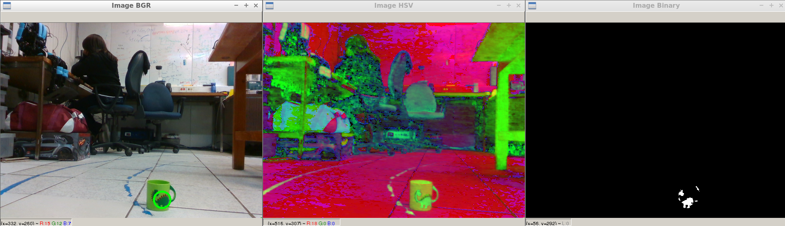
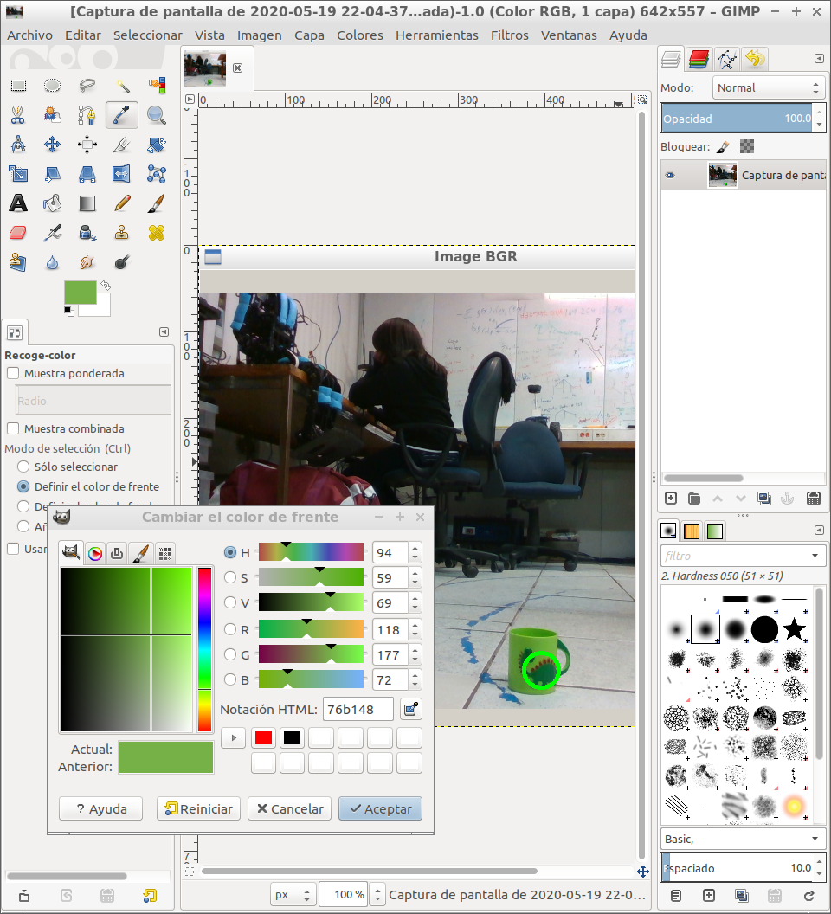
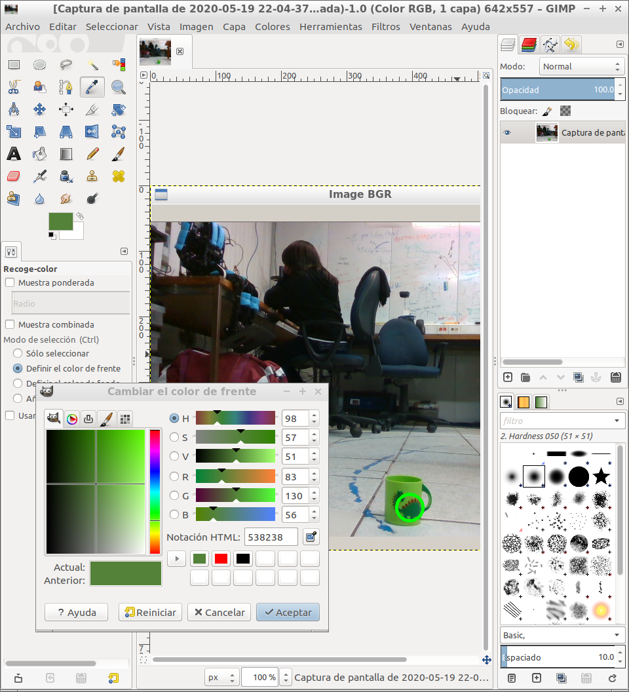
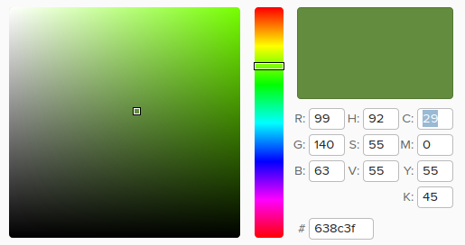
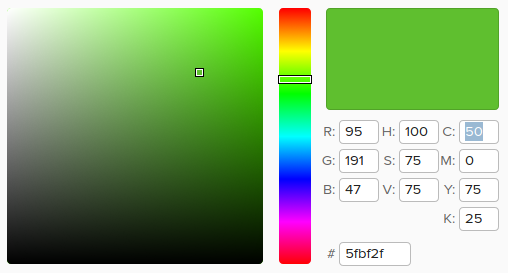
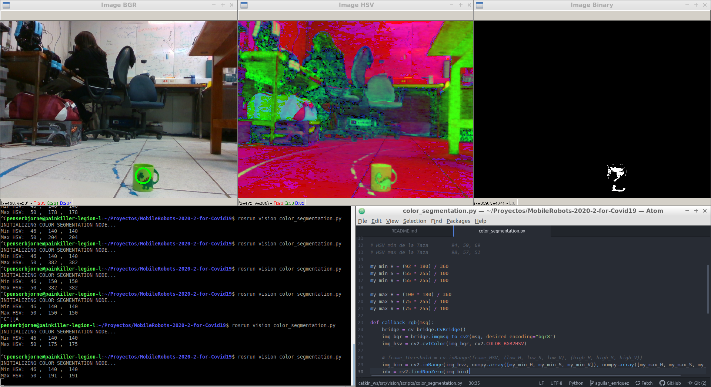

# Práctica 06

**Alumno:** Paul Sebastian Aguilar Enriquez <br>
**Número de cuenta:** 415028130

## Nota al lector

Este documento fue escrito originalmente en `Markdown` y posteriormente exportado a un PDF, por lo cual, para una mejor lectura, revisar el documento original en [https://github.com/mnegretev/MobileRobots-2020-2-for-Covid19/blob/aguilar_enriquez/Entregables/practica_06/README.md](https://github.com/mnegretev/MobileRobots-2020-2-for-Covid19/blob/aguilar_enriquez/Entregables/practica_06/README.md).

## Objetivo

- Segmentación por color.
- Realizar los ejercicios de la diapositiva 28.

## Entregables

- Capturas de pantalla donde se muestre la segmentación de la lata de coca cola o de la taza verde.
- Comentarios sobre los resultados obtenidos.
- Comentarios sobre los problemas encontrados.
- Copia del archivo `color_segmentation.py` con los umbrales utilizados.

## Desarrollo

Al ejecutar el nodo `rosrun vision color_segmentation.py` se abrieron tres ventanas:

<div align="center">



Ventanas de segmentación de color

</div>

Según la documentación de la función `inRange` tenemos que considerar los siguientes parámetros:

`cv.inRange(frame_HSV, (low_H, low_S, low_V), (high_H, high_S, high_V))`

Por lo cual necesitamos obtener el rango de los valores.

Extracción de los valores HSV mediante `GIMP`:

<div align="center">



Extracción de los valores HSV mínimos mediante GIMP.



Extracción de los valores HSV máximos mediante GIMP.

</div>

Valores mínimos:

- `H`: 94
- `S`: 59
- `V`: 69

Valores máximos

- `H`: 98
- `S`: 57
- `V`: 51

Los valores extraídos son los que vamos a utilizar en la función `inRange`.

Peeeeeeeeeeeeeero! Necesitamos tener en cuenta la anotación que nos dicen en las presentación del curso:

~~~
Nota: En OpenCV, los valores de Saturation y Value se almacenan como valores entre 0 y 255.
El valor de Hue es un ángulo y suele calcularse en grados, sin embargo, puesto que 360 no puede expresarse con 8 bits, OpenCV almacena la mitad del ángulo en el canal Hue.
~~~

Por lo que necesitamos considerar que los valores que nos esta arrojando `GIMP` son en formato
HSV donde:

- `H` pertenece a un intervalo de [0,360]
- `S` y `V` pertenecen a un intervalo de [0,100] cada uno

Por lo que en el código necesitamos acotarlos a un intervalo donde:

- `H` pertenece a un intervalo de [0,180]
- `S` y `V` pertenecen a un intervalo de [0,255] cada uno

Habiendo dicho lo anterior tenemos que hacer una regla de tres para convertir nuestros valores.

```python
my_min_H = (94 * 180) / 360
my_min_S = (59 * 255) / 100
my_min_V = (69 * 255) / 100

my_max_H = (98 * 180) / 360
my_max_S = (57 * 255) / 100
my_max_V = (51 * 255) / 100
```

Esto permite acotar los valores arrojados por `GIMP` a los que toma como entrada la función `inRange`.

Solo que hay un detalle, como podemos observar en la imagen del inicio, en el formato HSV hay demasiados elementos que pertenecen a un rango de color similar.

Haciendo un ajuste entre prueba y error, se encontró que los mejores valores para segmentar la taza son:

```python
my_min_H = (92 * 180) / 360
my_min_S = (55 * 255) / 100
my_min_V = (55 * 255) / 100

my_max_H = (100 * 180) / 360
my_max_S = (75 * 255) / 100
my_max_V = (75 * 255) / 100
```

Para llegar a este resultado se opto por dejar los valores de `H` entre 92 y 100, este rango permite movernos en un color verde similar al de la taza, `V` y `S` de valores iguales en un rango que nos permiten mover el color verde de la taza entre sus tonos más claros y oscuros.

A continuación de se muestra una imagen de los colores a los que corresponde.

<div align="center">



Color oscuro.



Color claro.

</div>

Habiendo obtenido los colores anteriores y asignándolos al código se pudo realizar la segmentación deseada.

<div align="center">



Taza segmentada.

</div>

## Comentarios y complicaciones

La practica fue bastante interesante, es de las que implico un poco más de reto en su desarrollo.

La primera complejidad que encontré fue la relación de los valores entre `HSV` y los que requería la función `inRange`.

La documentación de la función es clara en su contenido y basto con la nota que venia en las diapositivas.

La segunda complejidad fue acertar en los valores adecuados de `HSV` ya que una alteración en alguna de las componentes podía provocar que la segmentación no fuera la adecuada.

La clave en lo anterior fue encontrar un color base, en este caso el correspondiente al verde mediante `H` y jugar un poco con los valores de `S` y `V`, esto claro tomando como punto de partida los valores extraídos mediante `GIMP`, no se trata de adivinar tal cual, si no de tener un punto de partida y desde ahí ir ajustando.

### Copia del archivo `color_segmentation.py` con los umbrales utilizados

- [Copia de color_segmentation.py](./color_segmentation.py)
