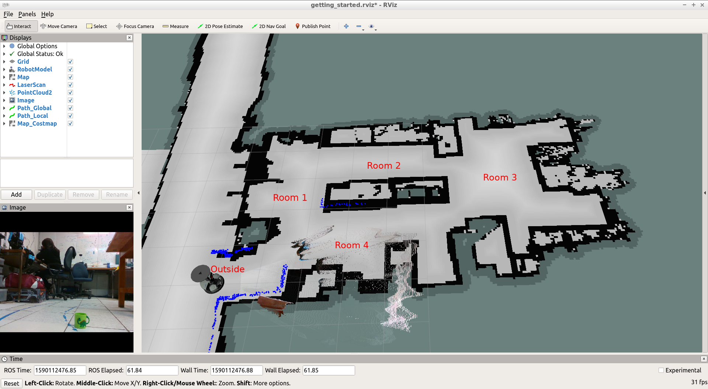

# Proyecto

**Alumno:** Paul Sebastian Aguilar Enriquez <br>
**Número de cuenta:** 415028130

## Nota al lector

Este documento fue escrito originalmente en `Markdown` y posteriormente exportado a un PDF, por lo cual, para una mejor lectura, revisar el documento original en [https://github.com/mnegretev/MobileRobots-2020-2-for-Covid19/blob/aguilar_enriquez/Entregables/proyecto/README.md](https://github.com/mnegretev/MobileRobots-2020-2-for-Covid19/blob/aguilar_enriquez/Entregables/proyecto/README.md).

## Objetivo

Hacer un programa en `Python` o `C++` que haga que el robot obedezca un comando
de voz. Dadas las capacidades limitadas del robot, los comandos de voz serán del
tipo:

- Robot, ve a la sala
- Robot, detente
- Robot ve a la cocina.

Una vez que el robot ha alcanzado la posición deseada, deberá anunciar por voz
(síntesis) que ha realizado la tarea con éxito.

El estudiante determinará los puntos del mapa que correspondan a cada una de
estas posiciones. Para que funcione el reconocimiento de voz, el estudiante
también debe hacer la gramática correspondiente.

Se deja a elección del estudiante las oraciones que el robot puede reconocer,
solo se pide que el robot sea capaz de reconocer al menos cuatro comandos
diferentes.

## Entregables

Video donde se escuche claramente el comando de voz y se observe en el simulador
que el robot se mueve a la posición deseada. Al finalizar el movimiento, se debe
escuchar la síntesis de voz anunciando que la tarea se realizó con éxito.

## Desarrollo

### Launcher

Se creó un archivo `proyecto.launch` en el cual se añadieron los elementos
para:

- Arrancar el simulador con robotino
- Navegación
- Reconocimiento de voz
- Sintetizador de voz
- Lógica del robot

Para iniciar el proyecto se puede utilizar el comando

```bash
roslaunch bring_up proyecto.launch
```

### Reconocimiento de voz

Se definieron los siguientes comandos:

- Robot move [to room] |one|two|three|four
- Robot move outside
- Robot stop
- Robot dance

En el archivo `proyecto.launch` se asigno la gramática y el diccionario a
utilizar:

```yaml
<param name="gram" value="$(find pocketsphinx)/vocab/proyecto"/>
<param name="dict" value="$(find pocketsphinx)/vocab/proyecto.dict"/>
<param name="grammar" value="proyecto"/>
<param name="rule" value="command"/>
```

Para la creación del diccionario se utilizaron las siguientes herramientas que
ayudaron para obtener la pronunciación de las palabras:

- [http://www.speech.cs.cmu.edu/cgi-bin/cmudict](http://www.speech.cs.cmu.edu/cgi-bin/cmudict)
- [http://www.speech.cs.cmu.edu/tools/lextool.html](http://www.speech.cs.cmu.edu/tools/lextool.html)

El diccionario creado fue:

```
ROBOT     R AH B AA T
MOVE      M UW V
TO        T UW
ROOM      R UW M
ONE       W AH N
TWO       T UW
THREE     TH R IY
FOUR      F AO R
OUTSIDE   AW T S AY D
DANCE     D AE N S
STOP      S T AA P

```

La gramática creada fue:

```
grammar proyecto;

public <command> = ROBOT (<move> | <move_out> | <dance> | <stop>);

<move> = MOVE TO ROOM (ONE | TWO | THREE | FOUR);
<move_out> = MOVE OUTSIDE;
<dance> = DANCE;
<stop> = STOP;
```

### Lógica del robot

Para este caso se opto por desarrollar la lógica del robot en el archivo
`catkin_ws/src/pocketsphinx/scripts/asr_test.py`, esto por las siguientes razones:

- El reconocimiento de voz se encuentra en este archivo
- Por tiempo, ya hay que hacer la entrega del proyecto :(

### Reconocimiento de comandos

Se hizo una clase llamada `GetCommand` que se invoca cuando se ha reconocido
alguna frase y que simplemente verifica algunas palabras clave en su contenido.

```python
class GetCommand(object):
    def __init__(self, command):

        #Mostramos el texto recibido
        print "DETECTED COMMAND: " + command

        # Verificamos si es un movimiento de robot
        if "MOVE" in command:
            # Determinamos a donde movernos
            if "ONE" in command:
                # Hacemos que el robot indique se va a mover
                SaySomethingRobot("MOVING TO ROOM ONE")
                # Nos movemos a un punto
                MoveToPoint(1)
            elif "TWO" in command:
                # Hacemos que el robot indique se va a mover
                SaySomethingRobot("MOVING TO ROOM TWO")
                # Nos movemos a un punto
                MoveToPoint(2)
            elif "THREE" in command:
                # Hacemos que el robot indique se va a mover
                SaySomethingRobot("MOVING TO ROOM THREE")
                # Nos movemos a un punto
                MoveToPoint(3)
            elif "FOUR" in command:
                # Hacemos que el robot indique se va a mover
                SaySomethingRobot("MOVING TO ROOM FOUR")
                # Nos movemos a un punto
                MoveToPoint(4)
            elif "OUTSIDE" in command:
                SaySomethingRobot("MOVING OUTSIDE")
                # Nos movemos a un punto
                MoveToPoint(0)
        # Verificamos otras instruccions
        elif "STOP" in command:
            SaySomethingRobot("NO, NOTHING CAN'T STOP ME")
        elif "DANCE" in command:
            SaySomethingRobot("SORRY BUT I DON'T KNOW HOW TO DANCE YET")
```

### Sintezis de

Para la sintezis de voz se tomo el código proporcionado y se incorporo a una
clase llamada `SaySomethingRobot`.

```python
class SaySomethingRobot(object):

    def __init__(self, text_to_say):
        rospy.init_node("speech_syn")
        pub_speech = rospy.Publisher("robotsound", SoundRequest, queue_size=10)
        loop = rospy.Rate(2)

        msg_speech = SoundRequest()
        # Indicamos que se va a reproducir un texto una sola vez
        msg_speech.sound   = -3
        msg_speech.command = 1
        msg_speech.volume  = 1.0
        # Indicamos la voz
        msg_speech.arg2    = "voice_kal_diphone"
        #self.msg_speech.arg2    = "voice_en1_mbrola"
        #self.msg_speech.arg2    = "voice_us1_mbrola"

        # Indicamos el mensaje
        msg_speech.arg = text_to_say

        loop.sleep()
        print "ROBOT SAY: " + text_to_say
        pub_speech.publish(msg_speech)
```


### Velocidad del robot

Se modifico el archivo `catkin_ws/src/config_files/move_base_params/costmap_common_params.yaml`
para asignar los siguientes valores con la finalidad de agilizar el movimiento del robot:

```yaml
cost_scaling_factor:  5.0  # exponential rate at which the obstacle cost drops off (default: 10)
inflation_radius:     2.5  # max. distance from an obstacle at which costs are incurred for planning paths.
```

Se modifico el archivo `catkin_ws/src/config_files/move_base_params/dwa_local_planner_params.yaml`
para asignar los siguientes valores con la finalidad de incrementar la velocidad del robot:

```yaml
max_vel_x: 2.0  # 0.55
max_vel_y: 2.0  # diff drive robot
max_trans_vel: 2.0 # choose slightly less than the base's capability
max_rot_vel: 5.0  # choose slightly less than the base's capability
acc_lim_x: 2.0 # maximum is theoretically 2.0
```

### Movimiento a puntos

Se han establecido cuatro habitaciones y un punto "fuera" del mapa.

<div align="center">



Habitaciones en el mapa

</div>

Para desplazar el robot se utilizó el paquete `actionlib`. Se creo una clase
llamada `MoveToPoint` en la cual toma como referencia el mapa global y no el
robot para poder dar coordenadas absolutas.

```python
class MoveToPoint(object):

    def __init__(self, point):
        # Creamos el cliente
        client = actionlib.SimpleActionClient('move_base', MoveBaseAction)
        client.wait_for_server()
        imDone = ""

        # Definimos los puntos
        goal = MoveBaseGoal()
        goal.target_pose.header.frame_id = "map"
        goal.target_pose.header.stamp = rospy.Time.now()

        if point == 0:  # OUTSIDE
            goal.target_pose.pose.position.x = 0.0
            goal.target_pose.pose.position.y = 0.0
            goal.target_pose.pose.orientation.w = 1.0
            imDone = "I'M OUTSIDE"
        elif point == 1: # Room 1
            goal.target_pose.pose.position.x = 1.5
            goal.target_pose.pose.position.y = 2.5
            goal.target_pose.pose.orientation.w = 1.0
            imDone = "I'M IN THE ROOM ONE"
        elif point == 2: # Room 2
            goal.target_pose.pose.position.x = 4.0
            goal.target_pose.pose.position.y = 3.5
            goal.target_pose.pose.orientation.w = 1.0
            imDone = "I'M IN THE ROOM TWO"
        elif point == 3: # Room 3
            goal.target_pose.pose.position.x = 7.0
            goal.target_pose.pose.position.y = 2.5
            goal.target_pose.pose.orientation.w = 1.0
            imDone = "I'M IN THE ROOM THREE"
        elif point == 4: # Room 4
            goal.target_pose.pose.position.x = 3.0
            goal.target_pose.pose.position.y = 1.0
            goal.target_pose.pose.orientation.w = 1.0
            imDone = "I'M IN THE ROOM FOUR"

        # Nos movemos
        client.send_goal(goal)

        wait = client.wait_for_result()

        if not wait:
            # Indicamos que algo ha pasado
            SaySomethingRobot("HELP ME PLEASE, I'M STUCK HERE")
            rospy.logerr("ACTION SERVER IS NOT AVAILABLE")
            rospy.signal_shutdown("ACTION SERVER IS NOT AVAILABLE")
        else:
            # Indicamos que hemos llegado al punto
            rospy.loginfo(imDone)
            SaySomethingRobot(imDone)
```

## Enlace al video

- [Video del proyecto](./video/video_proyecto.flv)
